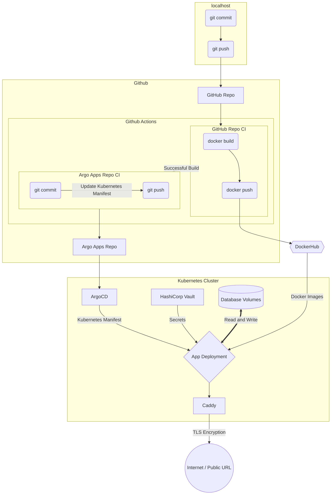

# argocd

Deploy Argo CD:
```bash
kubectl create namespace argocd
kubectl apply -n argocd -f https://raw.githubusercontent.com/argoproj/argo-cd/stable/manifests/install.yaml
```

Run port-forward for getting to the dashboard https://127.0.0.1:8080:
```bash
kubectl port-forward svc/argocd-server -n argocd 8080:443
```

ID: `admin` Pass:
```bash
kubectl -n argocd get secret argocd-initial-admin-secret -o jsonpath="{.data.password}" | base64 -d; echo
```

---

### CI/CD Workflow:

